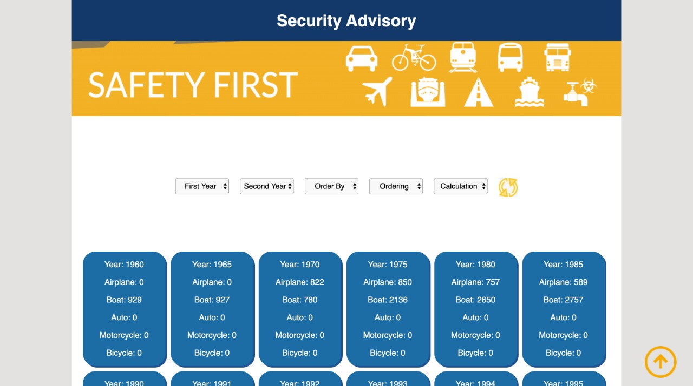

# Data Lovers

## Índice

* [1. Introdução](#1-introdução)
* [2. Definição do produto, objetivo e usuários](#2-definição-do-produto-objetivo-e-usuários)
* [3. Processo e decisões](#3-processo-e-decisões)
* [4. Vídeo da aplicação](#4-vídeo-da-aplicação)
  
## 1. Introdução

Segundo a [Forbes](https://www.forbes.com/sites/bernardmarr/2018/05/21/how-much-data-do-we-create-every-day-the-mind-blowing-stats-everyone-should-read), 90% dos dados que existem hoje foram gerados durante os últimos dois anos. A cada dia geramos 2.5 milhões de terabytes de dados, uma cifra sem precedentes.

Apesar disso, os dados por si só são de pouca  utilidade. Para que essas grandes quantidades de dados se convertam em **informação** compreensível para os usuários, precisamos entender e processar estes dados. Uma forma simples de fazer isso é criando _interfaces_ e _visualizações_.

## 2. Definição do produto, objetivo e usuários 

O usuário é uma Assessoria de Segurança que visa a diminuição dos acidentes de trabalho de seus clientes. Para mostrar os dados de forma dinâmica e visualmente organizada para os clientes, foi criada uma página web que permite ao usuário filtrar os dados por ano e ordená-los, além de permitir o cálculo do total e média dos acidentes por categoria.

## 3. Processo e decisões

Neste projeto construimos uma página web para visualizar um conjunto (set) de dados que se adequa às necessidades do usuário. A página web criada permite **visualizar dados, filtrá-los, ordená-los e fazer um cálculo agregado**. 

O [conjunto  de dados](src/data/injuries/injuries.json) utilizado mostra o número de pessoas feridas em acidentes de transporte nos EUA, com dados anuais desde 1960 e categorizados por tipo de transporte (avião, barco, automóvel, moto e bicicleta). 

A interface do usuário mostra os dados em cards, permite ao usuário filtrar e ordenar dados, além de calcular estatísticas (total de acidentados e média aritmética). A interface também é **responsiva**, ou seja, pode ser visualizada sem problemas a partir de diversos tamanhos de tela: celulares, tablets, notebooks, etc.

O produto apresenta os seguintes arquivos:

### `src/index.html`

Contém a marcação HTML e chama o CSS e JavaScript necessários.

### `src/main.js`

Neste arquivo estão todos os códigos relacionados
com a exibição dos dados na tela (interação com o DOM).

### `src/data.js`

Este arquivo contém toda a funcionalidade que corresponde a obter, processar e manipular dados (suas funções):

* `filterData(data, condition)`: esta função recebe os dados e retorna os que cumprem com as condições.

* `sortData(data, sortBy, sortOrder)`: esta função recebe três parâmetros. O primeiro, `data`, entrega os dados. O segundo, `sortBy`, diz respeito à qual das informações quer usar para ordenar. O terceiro, `sortOrder`, indica se quer ordenar de maneira crescente ou decrescente.

* `computeStats(data)`: essa função permite fazer cálculos estatísticos básicos para serem exibidos de acordo com o que os dados permitem.

Essas funções são [_puras_](https://imasters.com.br/desenvolvimento/serie-js-e-vida-pure-functions-funcoes-puras)
e independentes do DOM. Elas são usadas a partir do arquivo `src/main.js` ao carregar a página e a cada vez que o usuário interagir com a interface (cliques, seleções, filtros, ordenação, etc).

### `src/data`

Nesta pasta está o conjunto de dados que mostra o número de pessoas feridas em acidentes de transporte nos EUA.

### `test/data.spec.js`

 Este arquivo contém os testes unitários das funções implementadas no arquivo `data.js`.

## 4. Vídeo da aplicação

* Clique na imagem a seguir para assistir o vídeo:

